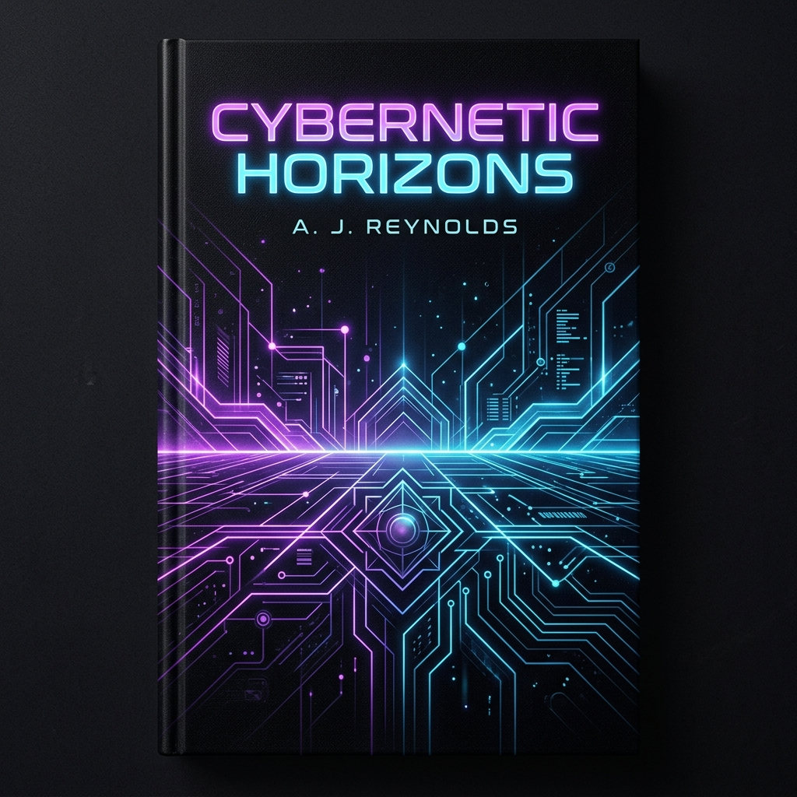

# ⚡ Challenge #077: Interactive Thank You Dashboard

Welcome to the **Aether Labs Thank You Experience Dashboard**—a highly premium, dynamic web application designed to thank users for downloading either a mobile app or a free eBook. 

Instead of presenting a static text block, this page transforms user checkout into an engaging, multi-sensory playground. It utilizes **HTML5 Canvas**, **Vanilla CSS**, and **jQuery** to implement high-end interactive systems, including responsive 3D card tilt physics, a digital scratch-off reward coupon, custom-particle confetti blasts, eye-tracking vectors on a responsive vector robot mascot, and mathematically synthesized 8-bit retro audio.

---

## 📸 Interactive Preview & Premium Assets

Below is a live recording of the dynamic post-download dashboard showing state transitions, 3D mouseover perspective tilts, pupil tracking Mascot physics, star rating particle explosions, and the brush-metallic scratch-off reveal in action:

<p align="center">
  
</p>

### 🎨 Curated Production-Ready Design Assets
The repository contains fully completed custom-generated premium design graphics, eliminating generic templates or empty placeholders:

<p align="center">
  
  
</p>

---

## ✨ Features Breakdown

### 🔄 1. Fluid Experience Toggle (Double Theme System)
The UI incorporates a master state system that seamlessly toggles the dashboard between two entirely separate branding and layout experiences:
*   **The App Innovation Mode (Default)**: Deep space-dark aesthetic with neon-violet and electric cyan gradients. Features a live linear installation download simulator and an interactive smartphone mockup.
*   **The eBook Haven Mode**: Warm walnut and rich amber gold ambient lighting. Features a 3D rotating book mockup and a detailed HTML5 Canvas scratch-off mystery reward card.

### ✍️ 2. HTML5 Canvas Scratch-Off Coupon
Under the eBook mode, users are presented with a silver brushed metal card containing a "mystery reward."
*   **Realistic Brushed Texture**: Drawn mathematically on a canvas with multi-layered linear gradients and simulated noise grains.
*   **Erasing Mechanics**: Utilizes `globalCompositeOperation = 'destination-out'` to dynamically carve away transparent strokes as the user's cursor or touch drags over the card.
*   **Threshold Scanning**: At regular intervals, the engine scans the canvas's pixel alpha values using the `getImageData` API. Once $\ge 60\%$ of the surface is cleared, the silver coating fades out automatically via jQuery, accompanied by a success chime and a vibrant confetti shower, revealing a copyable `HORIZON50` 50% discount code.

### 📊 3. Live Linear Setup Simulator
Under the App mode, the dashboard simulates a live package extraction.
*   **Dynamic Status Streams**: Updates text prompts dynamically ("Connecting to mirrors...", "Caching graphic pak...", "Verifying cryptographic checksums...") while fluctuating speeds realistically in `MB/s`.
*   **Step Progress Milestones**: Animates checklists systematically, changing step bullets into success icons as milestones (50%, 80%, 100%) are achieved.
*   **Launcher Actions**: Enables and triggers major chord sounds upon completion, morphing the disabled action button into an active "Launch Dashboard" trigger.

### 🛸 4. Interactive 3D Perspective Card Tilt
Using 3D transform layers, the mobile mockups and book assets react instantly to cursor position.
*   **Mathematics**: Calculates cursor coordinates relative to the card's center boundary:
    $$\text{mouseX} = \frac{e.clientX - \text{rect.left} - \frac{\text{width}}{2}}{\frac{\text{width}}{2}}$$
*   **Rotations**: Maps coordinates to rotate the elements dynamically between $-16^\circ$ and $+16^\circ$ on both $X$ and $Y$ axes. Shadows cast in the opposite direction for physical realism.

### 🤖 5. "Joy" the Eye-Tracking SVG Mascot
An adorable vector robot sits in the sidebar, welcoming users and acting as an emotional anchor:
*   **Eye Tracking Vectors**: Calculates the arctangent of mouse position relative to the mascot's face center:
    $$\theta = \text{atan2}(dy, dx)$$
    translating pupil circles (`.pupil-left`, `.pupil-right`) smoothly towards the cursor location.
*   **Mascot Click Playgrounds**: Clicking Joy triggers retro synth bubbles, spins the mascot in 3D space, and outputs witty, humorous developer prompts.

### 🔊 6. Retro Synthesized Audio (Web Audio API)
To ensure **zero external network requests**, high reliability, and absolute offline compatibility, all sound effects are generated mathematically using the browser's native Web Audio API:
*   **Bubble sound**: Rapid upward sine-wave frequency sweep.
*   **Scratch scraping sound**: White noise buffer burst coupled to a bandpass audio filter.
*   **Success Fanfare**: An arpeggiated Major chord progression playing triangle oscillators in sequence.
*   *An elegant sound toggle button is provided in the header to instantly mute/unmute all synthesized waveforms.*

---

## 📂 File Architecture

```
├── assets/
│   ├── ebook_cover.png      # Generated premium vertical scifi eBook cover
│   └── app_mockup.png       # Generated premium glowing app screen dashboard UI
├── index.html               # Semantic HTML5 content layout and CDNs
├── style.css                # CSS variables, glassmorphism tokens, mascot animations, grids
├── script.js                # Core state managers, sound synth, scratcher canvas, particles
└── README.md                # Project documentation and developer resources
```

---

## 🛠️ Developer Setup & Local Running

1.  **Clone or Open Folder**: Ensure all four core assets are in the same folder structure.
2.  **No Server Required**: Because the script runs with a completely self-contained canvas confetti particle system and synthesized Web Audio, you do not need to install complex web servers.
3.  **Run Locally**: Simply double-click [index.html](file:///c:/Users/abhi_/OneDrive/Desktop/Logo/design/testing/Challenge/%23077/Prompt/Thank/You/(Page/or/Message)/index.html) to open the dashboard directly in Chrome, Firefox, Safari, or Microsoft Edge.
4.  *Note: Make sure to click anywhere on the page to authorize the browser's standard AudioContext permissions so you can hear the retro synthesized sweeps and chimes!*

---

## 🧪 Production Scaling Options

To expand this template into a live commercial product:
*   **Webhook Hooks**: In the `script.js` download simulator completion trigger, make a POST call to a server node (`e.g. Node.js/Express`) to increment user download analytical metrics.
*   **Active Promo Codes**: Integrate the revealed scratch coupon code with a Shopify or Stripe payment hook, validating that coupon `HORIZON50` provides the configured discount inside checkouts.
*   **Live PDF downloads**: Swap out the placeholder eBook download link in the PDF card with your actual Amazon S3 download link or CDN asset stream.

---

*Developed with ❤️ as part of Challenge #077. Designed using Outfit & Plus Jakarta Sans typography.*
